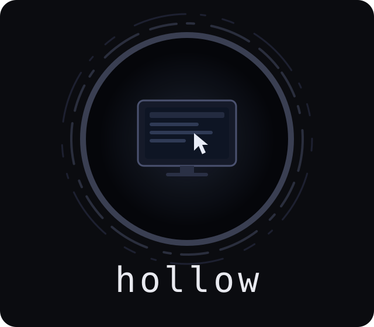

<div align="center">



# hollow

**Computers for bots.**<br>
*One host boots a small VM per agent and lets it see and drive the screen. It is self-hosted, on whatever machine has the memory.*

</div>

---

hollow is the machine room of a Grok-Bot-style setup: an always-on computer
for every agent, with a browser, a terminal and a filesystem. A host builds a
golden image per guest OS and boots a **desk** for every bot that asks. A
desk is a VM with a virtual display. The host answers one HTTP API for
screenshots, input, the browser as text, programs, files and screen
recording.

It is the bottom of three pieces, and each works on its own:

- **hollow** owns the VMs and the API. Run it on any Linux box with KVM.
- [bangboo](https://github.com/justin06lee/bangboo) is what an agent talks to.
  It is an MCP server and a CLI over any number of hollow hosts.
- [phaethon](https://github.com/justin06lee/phaethon) is the one thing to
  install. It carries both of the others, registers bangboo with every agent
  harness on the machine, and turns any machine ssh reaches into a host.

A desk is 1 GB by default and idles at under a hundred megabytes of that.
Compressed swap lets it behave like a machine twice its size when a heavy
page loads. Memory it frees goes back to the host.

## Install

The quickest way is phaethon, which installs hollow on a machine for you:

```sh
phaethon host add tenet          # any Linux machine with KVM that ssh reaches
```

On its own, from a clone:

```sh
make                             # build hollow, with the guest agent inside it, and install it
make ship HOST=root@tenet.makima # or: build for linux/amd64 and install it there as a service
```

Needs Go 1.26 or newer to build. A host needs an x86_64 Linux machine with
`/dev/kvm`. QEMU is installed for you if it is missing.

## Run a host

On the machine that will run the VMs:

```sh
sudo hollow service install
```

That is the whole setup, and it is what phaethon and `make ship` run. The
binary copies itself to `/usr/local/bin`, installs QEMU with the machine's
package manager if needed, and creates a `hollow` user in the `kvm` group. It
then registers a systemd unit that starts at boot and prints a connect code.
State lives in `/var/lib/hollow`. A hollow that was run by hand as root
carries its images and token over.

Then build the Linux image, once:

```sh
hollow pull linux
```

This downloads Alpine's cloud image and checks its checksum. It boots the
image once with a provisioning script and keeps the flattened result as the
golden image. That takes a few minutes, and every desk after that is a
copy-on-write clone that boots in about twenty seconds.

```sh
hollow service status          # is it running, and answering
sudo hollow service uninstall  # stop it; --purge also deletes images and the token
journalctl -u hollow -f        # its log
```

To run it in the foreground instead:

```sh
hollow serve
```

| Flag | What it does |
|---|---|
| `--addr HOST:PORT,...` | Listen exactly here, instead of loopback plus every mesh address. |
| `--port 7070` | The port for the default addresses. `HOLLOW_PORT` does the same. |
| `--state DIR` | Where images, desks and the token live. `HOLLOW_HOME` does the same. |
| `--advertise URL` | A URL to put first in connect codes. |
| `--idle 2h` | Stop desks nobody has used for this long. The default, 0, never stops them. |
| `--quiet` | Print nothing but errors. |

## Where it listens

A host listens on loopback and on every address the machine has on an
overlay network, and nowhere else. Overlay networks here mean makima,
Tailscale and plain WireGuard, which are exactly its point-to-point
interfaces. The LAN and the internet never see the port. Interfaces are
looked at again every ten seconds, so a mesh that starts after hollow is
picked up.

On a [makima](https://github.com/justin06lee/makima) mesh that publishes
loopback services, hollow and makima may both want the mesh address. Either
one holding it is fine.

## Connect from another machine

A **connect code** is the host's name, every address it answers at, and its
token, in one string:

```sh
hollow connect --url http://tenet.makima:7070    # --url puts that address first
```

Give it to bangboo on the machine where agents run:

```sh
bangboo host add hollow1-…
```

Or set it for the hollow CLI with `export HOLLOW_CONNECT=hollow1-…`. A
client uses the first address in the code that answers as the right host,
and moves to another when that one stops answering. phaethon does all of
this for you.

## Use a desk from the command line

The hollow CLI is the low-level client. An agent wants
[bangboo](https://github.com/justin06lee/bangboo), which offers the same
desks as tools.

```sh
hollow new --name research            # boot a desk, wait until it can be driven, print its id
hollow ls
hollow shot research                  # a PNG of the screen, with the pointer
hollow open research example.com      # open a page in the desk's Chromium
hollow read research                  # the page as text, with numbered elements
hollow click research 640 400
hollow type research hello there
hollow key research ctrl+l
hollow exec research -- ls -la
hollow exec research --shell -- 'echo $DISPLAY'
hollow windows research
hollow clip research                  # read the clipboard; give text to set it
hollow put research notes.txt notes.txt
hollow get research out.png out.png
hollow rec research start
hollow rec research stop clip.mp4
hollow rm research
```

Desks are named or numbered. Flags go anywhere on the line. Programs run as
the desk's user, `bot`, with the display set and passwordless `sudo`.

## The API

`Authorization: Bearer <token>` on everything except `hello` and the agent
download.

| | |
|---|---|
| `GET /v1/hello` | That a hollow is here, its version and name. It needs no token, which is how scans find hosts. |
| `GET /v1/status` | Version, capacity, addresses, images, desk count. |
| `GET /v1/images` · `GET /v1/images/{os}` · `POST /v1/images/{os}/pull` | Golden images and their state. A pull returns at once, so poll it. |
| `GET /v1/desks` · `POST /v1/desks` | List desks, or boot one from a `DeskSpec`. A name already in use gets a 409. |
| `GET /v1/desks/{id}` · `DELETE /v1/desks/{id}` | One desk, by id or name, or stop it. |
| `GET /v1/desks/{id}/screenshot` | PNG. The query takes `x,y,w,h` for a region, `fit=WxH` to scale, `settle=MS` to wait for the screen to stop changing, and `format=jpeg`. |
| `POST /v1/desks/{id}/input` | One `Input`: move, click, dblclick, tripleclick, down, up, scroll, type, key, hold, drag. Modifiers can be held. |
| `GET /v1/desks/{id}/cursor` | Where the pointer is. |
| `POST /v1/desks/{id}/browser/open` · `read` · `click` · `type` · `eval` | Chromium over DevTools. A read returns the page as text with numbered elements, and click and type take those numbers. |
| `GET` · `POST /v1/desks/{id}/windows` | List windows, or activate or close one. |
| `GET` · `PUT /v1/desks/{id}/clipboard` | Read or set the clipboard. |
| `POST /v1/desks/{id}/exec` | Run an `Exec` and get back an `ExecResult`. |
| `PUT` · `GET /v1/desks/{id}/files?path=` | Write and read files. |
| `POST /v1/desks/{id}/record/start` · `stop` | Record the screen. Stop returns the MP4. |
| `GET /v1/desks/{id}/health` · `logs` | The agent's view, and the serial console. |

The types are in [`api/types.go`](api/types.go) and a Go client is in
[`client`](client/client.go). Both are importable, which is what bangboo
does.

## How it works

**Images.** A pull boots Alpine's cloud image once, with a script handed in
on a virtual CD-ROM. The script installs Xvfb, Openbox, Chromium, xdotool,
ffmpeg, xclip, fonts including CJK, python3 and git. It also creates the
`bot` user and a boot service, then powers off. The result is flattened into
a standalone golden disk with a new name, so pulling again never touches the
disk under a running desk. Old golden disks are deleted once no desk uses
them. The script has a recipe number, and a host with an image from an older
recipe says so.

**Desks.** A desk is a QEMU/KVM VM booted from an overlay of the golden
disk. A second small CD-ROM holds its configuration: the host's port, the
screen size, its name, and a random key. At boot it starts compressed swap
and a virtual display, then fetches the **agent** from the host. The agent
is built into the hollow binary, so a new hollow never needs a new image.

**The agent.** This small program inside the desk answers only requests
carrying the desk's key. That matters because a mesh like makima publishes
every loopback port, desks' included. The agent grabs the screen from X and
composites the cursor on, and it waits for the screen to settle when asked.
It drives input through xdotool, reads windows from the window manager, and
runs programs as the desk's user. It drives Chromium over the DevTools
protocol and records with ffmpeg. Browser calls carry deadlines, and they
report when a desk is out of memory instead of hanging.

**Isolation.** Each bot gets its own VM. Desktops inside one VM would share
a pointer, a keyboard focus and a clipboard, and a bot on one could take
them from another. A separate VM costs a few tens of megabytes more and
removes the question.

## Known limits

- **Linux guests only, on an x86_64 Linux host with KVM.** The hypervisor is
  behind an interface so that macOS guests can follow. Those need Apple
  hardware and Apple's Virtualization framework. Windows guests can follow
  too. Neither is here yet.
- **Desks do not survive the host.** A desk is a running VM and nothing else.
  Restarting or upgrading hollow stops them. Persistent homes are the next
  thing to add.
- **The API is HTTP.** It is meant for loopback and meshes, where the
  transport is already encrypted and authenticated. Bound to a public address
  with `--addr`, the token is the only thing between the internet and a shell.
- **A guest can reach the host's loopback.** QEMU's user networking maps the
  host to `10.0.2.2`, which is how the agent is fetched. The API needs the
  token, and desks' agents need their keys. Anything else on the host's
  loopback is reachable from a desk.

## Layout

```
cmd/hollow            the CLI, the host (hollow serve), and hollow service
cmd/hollow-agent      the program inside a desk
api                   the wire types, shared by host, agent and clients
client                a Go client for the API, with multi-address failover
internal/host         the daemon: token, listeners, desks, the API server, the embedded agent
internal/image        golden images: download, verify, provision, flatten, clean up
internal/backend      the hypervisor interface, and qemu/ behind it
internal/agent        what the agent does: capture, input, windows, browser, exec, files, record
```
